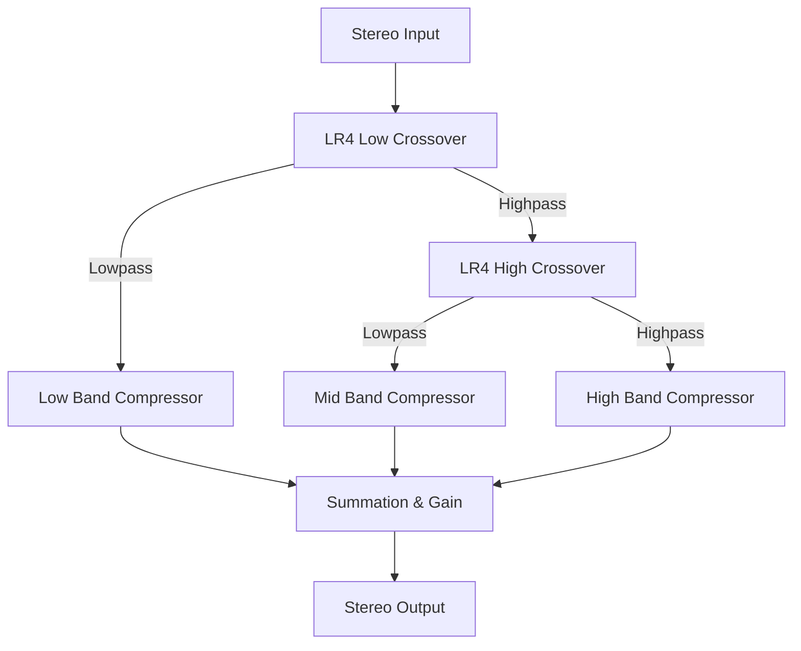

# Hott Compressor: DSP Logic and UI Details

The **Hott Compressor** is a D-language implementation of an **OTT-style (Over The Top) 3-band upward/downward compressor**. Below is a detailed breakdown of its digital signal processing (DSP) math and User Interface (UI) design.

---

## 1. DSP Logic

The audio path follows a 3-band split, dynamics processing per band, and summing.



### A. Linkwitz-Riley 4th Order (LR4) Crossover
To split the audio into 3 bands, we cascade Linkwitz-Riley 4th-order filters. An LR4 filter is created by connecting two identical 2nd-order Butterworth filters in series. This provides:
- A steep **24 dB/octave** slope.
- A flat amplitude sum when recombined.
- 360-degree phase difference between the bands, meaning they are perfectly **in-phase** and can be summed directly without phase cancellation.

The splits are:
- **Low Crossover** (Default: 88.3 Hz): Splits input into `Low` (Low-pass) and `High-ish` (High-pass).
- **High Crossover` (Default: 2.5 kHz): Splits `High-ish` into `Mid` (Low-pass) and `High` (High-pass).

### B. Level Detection (Peak vs. RMS)
For each band, we track the input level:
1. **Peak Mode**: Simply takes the absolute peak value of both channels:
   $$\text{input} = \max(|x_L|, |x_R|)$$
2. **RMS Mode**: Computes a Root-Mean-Square level over a **128-sample (~3 ms)** sliding window:
   $$\text{RMS} = \sqrt{\frac{1}{N}\sum_{n=0}^{N-1} x[n]^2}$$

The level is then converted to decibels:
$$\text{input\_db} = 20 \log_{10}(\text{input})$$

### C. Downward & Upward Dynamics Curve
Each band applies both **downward compression** (attenuating loud sounds) and **upward compression** (boosting quiet sounds).

```
Gain (dB)
  ^
  |      / (Upward Comp: slope < 1)
  |     /
  |----+ (Upward Threshold)
  |    |
  |    | (Linear / Dead zone: 1:1)
  |    |
  |----+ (Downward Threshold)
  |   /
  |  /  (Downward Comp: slope > 1)
  v /
```

1. **Downward Compression**:
   - Above the downward threshold $T_{down}$, we apply a ratio $R_{down}$:
     $$G_{down} = (T_{down} - x_{db}) \left(1 - \frac{1}{R_{down}}\right)$$
   - If **Soft Knee** is enabled, we quadratically smooth the transition over a 10 dB knee window ($W = 10$):
     $$G_{down} = -\left(1 - \frac{1}{R_{down}}\right) \frac{(x_{db} - T_{down} + W/2)^2}{2W}$$

2. **Upward Compression**:
   - Below the upward threshold $T_{up}$, quiet signals are boosted by $R_{up}$ (ratio $< 1.0$):
     $$G_{up} = (T_{up} - x_{db}) \left(1 - \frac{1}{R_{up}}\right)$$

3. **Envelope Follower**:
   The target gain change $G_{target} = G_{down} + G_{up}$ is smoothed via an attack/release envelope follower:
   - If $G_{target} < G_{env}$ (compression is active or increasing), we apply **Attack**:
     $$G_{env}[n] = \alpha_{att} \cdot G_{env}[n-1] + (1 - \alpha_{att}) \cdot G_{target}$$
   - If $G_{target} \ge G_{env}$ (gain is recovering or quiet), we apply **Release**:
     $$G_{env}[n] = \alpha_{rel} \cdot G_{env}[n-1] + (1 - \alpha_{rel}) \cdot G_{target}$$

The output gain factor is:
$$\text{Gain} = 10^{G_{env} / 20}$$

---

## 2. UI Details

The GUI is themed to match the **comp1** branch aesthetics.

- **Theme**: Dark teal/cyan. The window size matches `comp1`'s dimensions (400x580).
- **Background**: Smooth linear gradient from `BackgroundStart` (translucent cyan) to `BackgroundEnd` (dark grey-cyan).
- **Interactive Multi-band Display (`HottDisplayUI`)**:
  - Divided into 3 horizontal band rows (High, Mid, Low).
  - Shaded threshold zones:
    - **Upward Zone** (translucent light blue on the left).
    - **Linear Zone** (dark cyan in the center).
    - **Downward Zone** (translucent reddish/brown on the right).
  - **Level Overlay**: Shows real-time output level as a glowing cyan bar and input level as an orange dot.
  - **Draggable Threshold Handles**: Users can drag the vertical lines left and right to adjust threshold values.
  - **T/B/A Tabs**: Located in the bottom right corner of the display to switch between:
    - **Time (T)**: Shows/allows dragging Attack and Release times.
    - **Below (B)**: Shows/allows dragging Upward thresholds and ratios.
    - **Above (A)**: Shows/allows dragging Downward thresholds and ratios.
- **Controls Layout**:
  - **Top Row**: 4 large knobs for `Amount` (Dry/Wet), `Time` (envelope speed multiplier), `Out Gain` (global output), and `Low Crossover` frequency.
  - **Right Column**: 3 medium knobs for `H Out`, `M Out`, and `L Out` (per-band output gains).
  - **Bottom Row**: `High Crossover` knob, and switches for `Soft Knee` and `RMS Mode`.
