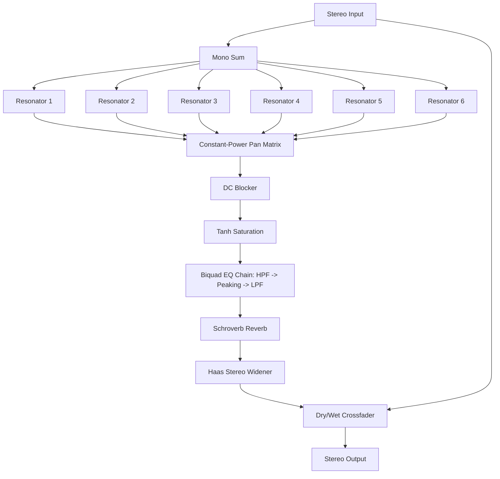

# kdr-rezonizer

`kdr-rezonizer` is a VST3 effect plugin written in the D language using Dplug. It adds harmonic resonance and rich textures to any sound source, turning simple or noisy leads into musical chords and wide, glittery electronic house leads, inspired by plugins like Xynth Audio's Rezonator.

---

## 1. High-Level DSP Design

The plugin's architecture combines fractional comb filtering, biquad equalization, Schroeder reverberation, and spatial delay to achieve dense, melodic resonance:



### 1.1 Fractional Comb Filtering
To ensure the resonator is perfectly in tune with musical notes across the spectrum, the comb filters use fractional-sample delay lines with **linear interpolation**.

For a target frequency $f$ and sample rate $f_s$:
* **Saw-Mode** (Positive feedback, resonating all harmonics):
  $$L_{saw} = \frac{f_s}{f}$$
  $$y(t) = x(t) + g \cdot w(t)$$
* **Square-Mode** (Negative feedback, resonating odd harmonics):
  $$L_{sq} = \frac{f_s}{2f}$$
  $$y(t) = x(t) - g \cdot w(t)$$

Where $g$ is the feedback coefficient computed from the decay time $T_{decay}$ in seconds:
$$g = \exp\left(-\frac{6.907755 \cdot L}{T_{decay} \cdot f_s}\right)$$

### 1.2 Damping & Color
High-frequency decay damping is modeled inside the feedback loop using a one-pole low-pass filter:
$$w(t) = (1 - d) \cdot y(t - L) + d \cdot w(t - 1)$$
where $d$ is the damping coefficient.

### 1.3 EQ Chain
The wet resonance path passes through three series biquad filters (RBJ Cookbook structures):
1. **High-Pass Filter (HPF)**: Removes muddy low-end frequencies.
2. **Peaking/Bell EQ**: Boosts or cuts specific target frequencies.
3. **Low-Pass Filter (LPF)**: Softens harsh high-end grit.

### 1.4 Schroeder Reverb
A parallel-comb, serial-allpass reverberation matrix is implemented directly on the wet signal to provide spatial depth and ringing tails. The low-frequency content in the reverb tail can be cut using a secondary dedicated biquad HPF.

### 1.5 Haas Widening
Adds psychoacoustic stereo width by delaying the right wet channel relative to the left:
$$\Delta t \le 30\text{ ms}$$

---

## 2. MIDI & Voice Allocation

When **MIDI Input** is enabled, the 6 resonators are driven by incoming MIDI messages rather than the static UI dials:

* **Normal Mode**:
  * Incoming `Note On` messages are dynamically routed to the first free resonator.
  * If all resonators are busy, the oldest active note is overridden (voice stealing).
  * `Note Off` triggers an exponential release envelope on that resonator using the **Release** parameter.
* **Round-Robin Mode**:
  * Notes are assigned in a circular round-robin fashion.
  * Releasing notes does **not** stop the resonators, allowing arpeggios to ring out continuously.

---

## 3. Parameter Reference

The plugin exposes **52 parameters** to the host DAW:

| Category | Parameter Name | Range | Default | Description |
| :--- | :--- | :--- | :--- | :--- |
| **Basic** | Dry Gain | -60.0 to 12.0 dB | 0.0 dB | Volume of the unaffected input signal. |
| | Wet Gain | -60.0 to 12.0 dB | 0.0 dB | Volume of the resonated wet signal. |
| **Comb** | Mode | Saw, Square | Saw | Positive vs negative comb feedback structure. |
| | Decay | 0.01 to 10.0 sec | 1.0 sec | Length of feedback resonance tail. |
| | Color | 0.0 to 1.0 | 0.1 | High frequency damping factor in feedback. |
| **Filter** | Filter Bypass | On, Off | Off | Bypasses the wet path EQ chain. |
| | Filter HPF Freq | 20 to 2000 Hz | 20 Hz | Cutoff frequency for wet highpass filter. |
| | Filter LPF Freq | 100 to 20000 Hz | 20000 Hz | Cutoff frequency for wet lowpass filter. |
| | Filter Peak Freq | 20 to 20000 Hz | 1000 Hz | Center frequency for peaking EQ. |
| | Filter Peak Q | 0.1 to 10.0 | 1.0 | Bandwidth (resonance) of peaking EQ. |
| | Filter Peak Gain | -15.0 to 15.0 dB | 0.0 dB | Gain boost or cut for peaking EQ. |
| **MIDI** | MIDI Input Enable | On, Off | Off | Route MIDI notes to tune resonators. |
| | MIDI Mode | Normal, RR | Normal | Synthesizer-style vs circular round-robin. |
| | Release / Size | 0.01 to 10.0 sec | 1.0 sec | Release time (Normal) or note pool size. |
| **Reverb**| Reverb Enable | On, Off | Off | Enable built-in reverberation. |
| | Reverb Mix | 0.0 to 1.0 | 0.3 | Dry/wet balance of the reverb. |
| | Reverb Length | 0.0 to 1.0 | 0.5 | Room size / feedback of reverb combs. |
| | Reverb Lows | 0.0 to 1.0 | 0.2 | Amount of low frequencies kept in reverb. |
| | Reverb Highs | 0.0 to 1.0 | 0.2 | High frequency damping of reverb. |
| **Misc** | Portamento | 0.0 to 2.0 sec | 0.0 sec | Glide time between pitch transitions. |
| | Haas Width | 0.0 to 1.0 | 0.0 | Haas-delay stereo widening amount. |
| | Chord Preset | Unison, Major, Minor, Major7, Minor7, Sus4, Custom | Major | Chord offsets assigned to relative resonators. |
| **Voice** | Resonator 1-6 Enable| On, Off | On | Enable or disable individual resonators. |
| | Resonator 1 Pitch | 12.0 to 108.0 note | 60.0 (C4) | Absolute root note (Resonator 1 only). |
| | Resonator 2-6 Pitch | -36.0 to 36.0 semitones | Preset-based | Offset in semitones relative to Resonator 1. |
| | Resonator 1-6 Fine | -100.0 to 100.0 cents | 0.0 cents | Fine-tuning adjustment for each voice. |
| | Resonator 1-6 Gain | -60.0 to 12.0 dB | 0.0 dB | Relative gain level of individual resonators. |
| | Resonator 1-6 Pan | -1.0 to 1.0 | Symmetrical | Stereo panning position of each voice. |

---

## 4. How to Build & Install

1. Ensure the LDC D compiler and `dub` are installed.
2. Build the VST3 bundle from the plugin bin directory:
   ```bash
   cd bin/rezonizer
   dub run dplug:dplug-build -b=release -- --final -c VST3
   ```
3. The built VST3 bundle will be available under:
   `bin/rezonizer/builds/Windows-64b-VST3/`
